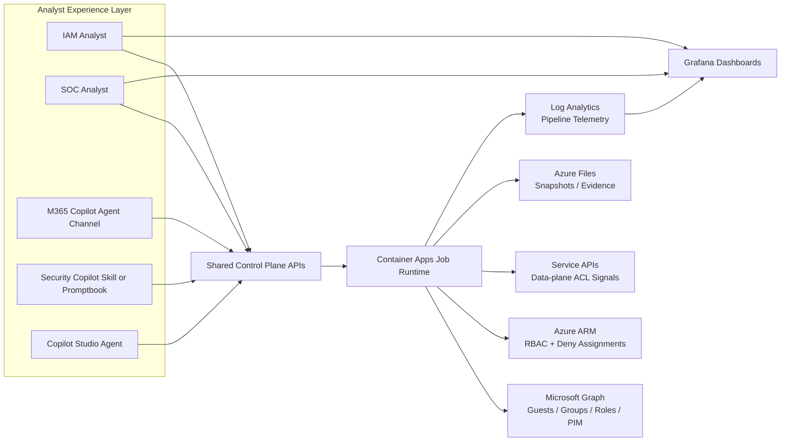

# Dev Agents Solutions

Enterprise-ready solution patterns for identity and access visibility across Entra + Azure.

## Guest Permissions Agent Solution (Azure + M365)

This solution gives security and IAM teams a repeatable way to answer:

- Which guest users exist in the tenant?
- What Azure resources can those guests reach?
- What is their **effective** access after inheritance, groups, PIM state, and deny logic?

It is designed for both:

- Internal architecture and operations demos
- Customer-facing deployment and handoff

---

## Deploy Now (Infrastructure Bootstrap)

[](https://portal.azure.com/#create/Microsoft.Template/uri/https%3A%2F%2Fraw.githubusercontent.com%2Fsamitks77%2Fdev-agents-solutions%2Fmain%2Ftemplates%2Fazuredeploy%2Fguest-permissions-solution.json)

This deploys baseline infrastructure:

- User-assigned managed identity
- Log Analytics workspace
- Storage account + Azure Files share
- Container Apps environment
- Azure Managed Grafana
- Optional operator RBAC grants

Why bootstrap first:

- You establish a secure, repeatable landing zone before runtime code and privileged identity grants are applied.

---

## Architecture at a Glance



### Agent surface strategy (recommended)

- **Primary SOC experience:** Security Copilot (best analyst fit for Defender/Sentinel workflows)
- **Primary IAM and cross-team experience:** Copilot Studio agent (flexible orchestration + channel options)
- **Optional distribution channel:** M365 Copilot declarative agent
- **Core rule:** all surfaces call the same control-plane APIs and runtime pipeline

---

## End-to-End Flow (What + Why)

| Stage | What it does | Why it matters |
|---|---|---|
| 1. Bootstrap | Deploy identity, logging, storage, runtime host, and dashboard host | Gives you an enterprise baseline you can reproduce in every environment |
| 2. Identity Grants | Apply required Graph + Azure permissions to runtime identity | Enforces least-privilege, auditable access to control planes |
| 3. Collection | Collect Entra, RBAC, deny, PIM, and optional data-plane signals | Builds complete access context instead of partial snapshots |
| 4. Resolution | Resolve effective guest permissions from all input snapshots | Produces action-ready evidence for governance and risk decisions |
| 5. Visualization + Ops | Publish dashboard + run monitoring and response loops | Makes posture visible for analysts, engineers, and leadership |

---

## Quick Start

1. Start with the field briefing artifact: [`docs/guest-permissions-field-briefing.html`](docs/guest-permissions-field-briefing.html)
2. Read the deployment runbook: [`docs/guest-permissions-deploy-to-azure.md`](docs/guest-permissions-deploy-to-azure.md)
3. Validate template and parameters: `./scripts/validate-guest-permissions-bootstrap.ps1`
4. Deploy infrastructure: `./scripts/deploy-guest-permissions-bootstrap.ps1`
5. Run smoke checks: `./scripts/post-deploy-smoke-test.ps1`
6. Walk through architecture and controls:
   - [`docs/guest-permissions-architecture.md`](docs/guest-permissions-architecture.md)
   - [`docs/guest-permissions-security-governance.md`](docs/guest-permissions-security-governance.md)
7. Use the demo playbook:
   - [`docs/guest-permissions-demo-playbook.md`](docs/guest-permissions-demo-playbook.md)

---

## Repository Map

```text
.
├── .github/workflows/
│   └── solution-quality.yml                   # JSON + PowerShell quality checks
├── docs/
│   ├── README.md                              # Documentation index
│   ├── guest-permissions-field-briefing.html  # World-class field briefing artifact
│   ├── guest-permissions-architecture.md      # End-to-end architecture and trust boundaries
│   ├── guest-permissions-deploy-to-azure.md   # Full deployment runbook (what + why)
│   ├── guest-permissions-operations-runbook.md# Day-2 operations and troubleshooting
│   ├── guest-permissions-security-governance.md # Security model and least-privilege design
│   ├── guest-permissions-demo-playbook.md     # Internal + customer demo script
│   └── guest-permissions-enterprise-readiness-checklist.md
├── scripts/
│   ├── deploy-guest-permissions-bootstrap.ps1 # Idempotent deployment wrapper
│   ├── validate-guest-permissions-bootstrap.ps1 # Local + Azure validation
│   └── post-deploy-smoke-test.ps1             # Post-deploy health checks
├── templates/
│   ├── README.md
│   └── azuredeploy/
│       ├── README.md                           # Template usage and parameter guide
│       ├── guest-permissions-solution.json     # ARM bootstrap template
│       ├── guest-permissions-solution.parameters.json
│       └── guest-permissions-solution-explained.md # Resource-by-resource rationale
└── solutions/
    └── driftlock-vector/                       # M365 Copilot declarative agent surface (self-contained)
        ├── m365agents.yml / m365agents.local.yml
        ├── appPackage/                          # Declarative agent + API plugin manifest
        └── api/                                 # Control-plane OpenAPI spec used by the agent
```

---

## Enterprise Readiness Highlights

- Explicit, step-by-step runbooks with **what each step does** and **why it exists**
- Separation of concerns between infra deployment and privileged identity grants
- Commented PowerShell scripts for repeatability and handoff
- Post-deploy smoke tests for confidence before demo or customer onboarding
- Security and governance guidance for least-privilege and auditability
- Built-in GitHub workflow for template/script quality checks

---

## Documentation Hub

Start here: [`docs/README.md`](docs/README.md)
