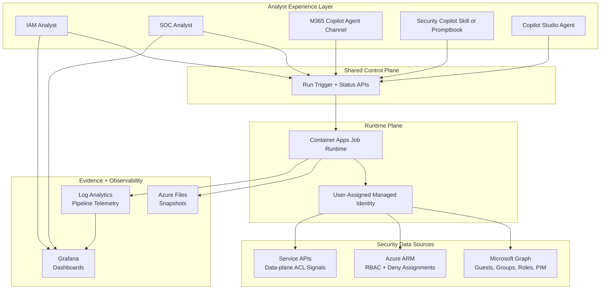

# Guest Permissions Solution — Architecture

## 1) Architecture Goals

1. Provide deterministic visibility into guest user access.
2. Separate bootstrap infrastructure from privileged identity grants.
3. Keep runtime collection observable, auditable, and repeatable.
4. Support both manual and automated operation modes.
5. Support analyst workflows across IAM and SOC surfaces.

---

## 2) Component Diagram

---

## 3) Analyst Surface Strategy (Important)

### Recommended placement

1. **SOC analysts:** use **Security Copilot** as the primary front door.
   - Reason: best alignment with Defender/Sentinel investigation workflows.
2. **IAM analysts and cross-functional teams:** use **Copilot Studio** as the primary front door.
   - Reason: flexible orchestration and channel targeting.
3. **M365 Copilot channel:** use as an optional distribution channel.
   - Reason: broad accessibility, but not the only or primary analyst surface.

### Key architecture rule

All experience surfaces should call the same control-plane APIs and runtime. This keeps behavior consistent and avoids duplicated logic.

---

## 4) Component Responsibilities (What + Why)

| Component | What it does | Why it exists |
|---|---|---|
| Managed Identity | Authenticates runtime without embedded secrets | Reduces secret sprawl and supports enterprise identity governance |
| Container Apps Job | Runs collection and resolution stages | Supports scheduled and on-demand execution with isolation |
| Graph + ARM + Service APIs | Source-of-truth control/data-plane permissions | Ensures complete guest access context across identity and resource layers |
| Azure Files | Stores run snapshots and artifacts | Preserves evidence for audit, comparison, and rollback analysis |
| Log Analytics | Stores run telemetry and execution signals | Enables operational monitoring and KPI tracking |
| Managed Grafana | Provides dashboards for analysts and leadership | Converts raw telemetry into actionable, visual insight |
| Security Copilot skill/promptbook | SOC-native run trigger and analysis surface | Meets analysts where Defender/Sentinel work happens |
| Copilot Studio agent | IAM and cross-team orchestration surface | Supports broader enterprise workflow and channel reach |
| M365 Copilot channel | Optional conversational distribution layer | Useful for broad discoverability and executive stakeholders |

---

## 5) Trust Boundaries

1. **Experience boundary**: Analyst entry points are channel-specific but share policy-aligned API controls.
2. **Operator boundary**: Human-initiated actions should be RBAC-gated and auditable.
3. **Runtime boundary**: Collection runtime should use least-privilege managed identity.
4. **Data boundary**: Snapshot storage and logs should be restricted by environment RBAC and retention policies.
5. **Presentation boundary**: Dashboard read access should be role-based and scoped.

---

## 6) Failure Domains and Recovery

| Failure domain | Typical symptom | Recovery action |
|---|---|---|
| Identity grants missing | API authorization errors during collection | Re-apply Graph/Azure role grants, re-run |
| Runtime config drift | Job starts but no useful output | Validate env vars/command sequence and image version |
| Telemetry ingestion issue | Job runs but dashboard empty | Validate Log Analytics wiring and query scope |
| Dashboard misconfiguration | Data exists but not visible | Reconfigure datasource/import dashboard JSON |
| Channel misconfiguration | Agent surface cannot trigger runs | Validate channel auth, plugin bindings, and API configuration |

---

## 7) Enterprise Design Choices

- **Separation of infra and privilege**: safer change control and approvals.
- **Shared runtime, multiple agent surfaces**: one data engine with channel-specific user experience.
- **Idempotent bootstrap**: easier re-deploys and environment parity.
- **Scripted validation and smoke tests**: faster handoff and confidence.
- **Doc-first runbooks**: predictable operations for internal and customer teams.
