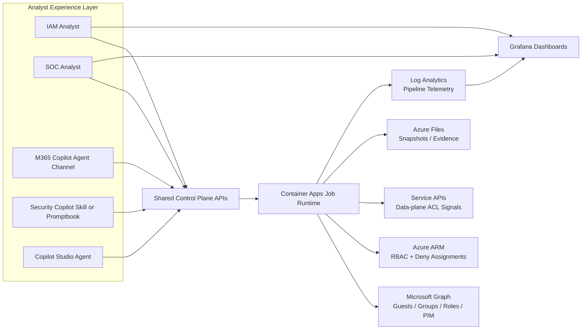

# driftlock-vector — Guest Permissions Solution (Azure + M365)

> Part of the [dev-agents-solutions](../../README.md) repo. This solution is fully self-contained: infra templates, docs, scripts, and the M365 Copilot declarative agent all live here in `solutions/driftlock-vector/`.

This solution gives security and IAM teams a repeatable way to answer:

- Which guest users exist in the tenant?
- What Azure resources can those guests reach?
- What is their **effective** access after inheritance, groups, PIM state, and deny logic?

It is designed for both:

- Internal architecture and operations demos
- Customer-facing deployment and handoff

---

## Deploy Now (Infrastructure Bootstrap)

[](https://portal.azure.com/#create/Microsoft.Template/uri/https%3A%2F%2Fraw.githubusercontent.com%2Fsamitks77%2Fdev-agents-solutions%2Fmain%2Fsolutions%2Fdriftlock-vector%2Ftemplates%2Fazuredeploy%2Fguest-permissions-solution.json)

This deploys baseline infrastructure:

- User-assigned managed identity
- Log Analytics workspace
- Storage account + Azure Files share
- Container Apps environment
- Azure Managed Grafana
- Optional operator RBAC grants

Why bootstrap first:

- You establish a secure, repeatable landing zone before runtime code and privileged identity grants are applied.

---

## Architecture at a Glance



### Agent surface strategy (recommended)

- **Primary SOC experience:** Security Copilot (best analyst fit for Defender/Sentinel workflows)
- **Primary IAM and cross-team experience:** Copilot Studio agent (flexible orchestration + channel options)
- **Optional distribution channel:** M365 Copilot declarative agent (this folder — see [M365 Copilot Declarative Agent](#m365-copilot-declarative-agent) below)
- **Core rule:** all surfaces call the same control-plane APIs and runtime pipeline

---

## End-to-End Flow (What + Why)

| Stage | What it does | Why it matters |
|---|---|---|
| 1. Bootstrap | Deploy identity, logging, storage, runtime host, and dashboard host | Gives you an enterprise baseline you can reproduce in every environment |
| 2. Identity Grants | Apply required Graph + Azure permissions to runtime identity | Enforces least-privilege, auditable access to control planes |
| 3. Collection | Collect Entra, RBAC, deny, PIM, and optional data-plane signals | Builds complete access context instead of partial snapshots |
| 4. Resolution | Resolve effective guest permissions from all input snapshots | Produces action-ready evidence for governance and risk decisions |
| 5. Visualization + Ops | Publish dashboard + run monitoring and response loops | Makes posture visible for analysts, engineers, and leadership |

---

## Quick Start

> All commands below assume you've `cd`'d into `solutions/driftlock-vector/` first.

1. Start with the field briefing artifact: [`docs/guest-permissions-field-briefing.html`](docs/guest-permissions-field-briefing.html)
2. Read the deployment runbook: [`docs/guest-permissions-deploy-to-azure.md`](docs/guest-permissions-deploy-to-azure.md)
3. Validate template and parameters: `./scripts/validate-guest-permissions-bootstrap.ps1`
4. Deploy infrastructure: `./scripts/deploy-guest-permissions-bootstrap.ps1`
5. Run smoke checks: `./scripts/post-deploy-smoke-test.ps1`
6. Walk through architecture and controls:
   - [`docs/guest-permissions-architecture.md`](docs/guest-permissions-architecture.md)
   - [`docs/guest-permissions-security-governance.md`](docs/guest-permissions-security-governance.md)
7. Use the demo playbook:
   - [`docs/guest-permissions-demo-playbook.md`](docs/guest-permissions-demo-playbook.md)

---

## Repository Map (this solution)

```text
solutions/driftlock-vector/
├── CHANGELOG.md
├── CONTRIBUTING.md
├── SECURITY.md
├── docs/
│   ├── README.md                              # Documentation index
│   ├── guest-permissions-field-briefing.html  # World-class field briefing artifact
│   ├── guest-permissions-architecture.md      # End-to-end architecture and trust boundaries
│   ├── guest-permissions-deploy-to-azure.md   # Full deployment runbook (what + why)
│   ├── guest-permissions-operations-runbook.md# Day-2 operations and troubleshooting
│   ├── guest-permissions-security-governance.md # Security model and least-privilege design
│   ├── guest-permissions-demo-playbook.md     # Internal + customer demo script
│   └── guest-permissions-enterprise-readiness-checklist.md
├── scripts/
│   ├── deploy-guest-permissions-bootstrap.ps1 # Idempotent deployment wrapper
│   ├── validate-guest-permissions-bootstrap.ps1 # Local + Azure validation
│   └── post-deploy-smoke-test.ps1             # Post-deploy health checks
├── templates/
│   ├── README.md
│   └── azuredeploy/
│       ├── README.md                           # Template usage and parameter guide
│       ├── guest-permissions-solution.json     # ARM bootstrap template
│       ├── guest-permissions-solution.parameters.json
│       └── guest-permissions-solution-explained.md # Resource-by-resource rationale
├── m365agents.yml / m365agents.local.yml       # M365 Agents Toolkit project files
├── appPackage/                                 # Declarative agent + API plugin manifest
├── api/                                        # Control-plane OpenAPI spec used by the agent
└── evals/                                      # Sample eval prompts for the declarative agent
```

---

## Enterprise Readiness Highlights

- Explicit, step-by-step runbooks with **what each step does** and **why it exists**
- Separation of concerns between infra deployment and privileged identity grants
- Commented PowerShell scripts for repeatability and handoff
- Post-deploy smoke tests for confidence before demo or customer onboarding
- Security and governance guidance for least-privilege and auditability
- Built-in GitHub workflow for template/script quality checks

---

## Documentation Hub

Start here: [`docs/README.md`](docs/README.md)

---

## M365 Copilot Declarative Agent

This is the optional distribution-channel agent surface referenced in [Agent surface strategy](#agent-surface-strategy-recommended) above. It's built with the M365 Agents Toolkit declarative agent template.

### Overview of the Declarative Agent template

With the declarative agent, you can build a custom version of Copilot that can be used for specific scenarios, such as for specialized knowledge, implementing specific processes, or simply to save time by reusing a set of AI prompts. For example, a grocery shopping Copilot declarative agent can be used to create a grocery list based on a meal plan that you send to Copilot.

### Get started with the template

> **Prerequisites**
>
> To run this app template in your local dev machine, you will need:
>
> - [Node.js](https://nodejs.org/), supported versions: 22
> - A [Microsoft 365 account for development](https://docs.microsoft.com/microsoftteams/platform/toolkit/accounts).
> - [Microsoft 365 Agents Toolkit Visual Studio Code Extension](https://aka.ms/teams-toolkit) version 5.0.0 and higher or [Microsoft 365 Agents Toolkit CLI](https://aka.ms/teamsfx-toolkit-cli)
> - [Microsoft 365 Copilot license](https://learn.microsoft.com/microsoft-365-copilot/extensibility/prerequisites#prerequisites)


1. First, select the Microsoft 365 Agents Toolkit icon on the left in the VS Code toolbar.
2. In the Account section, sign in with your [Microsoft 365 account](https://docs.microsoft.com/microsoftteams/platform/toolkit/accounts) if you haven't already.
3. Select `Preview Local in Copilot (Edge)` or `Preview Local in Copilot (Chrome)` from the launch configuration dropdown.
4. Select your declarative agent from the `Copilot` app.
5. Ask a question to your declarative agent and it should respond based on the instructions provided.

### What's included in the template

| Folder       | Contents                                                                                 |
| ------------ | ---------------------------------------------------------------------------------------- |
| `.vscode`    | VSCode files for debugging                                                               |
| `appPackage` | Templates for the application manifest, the GPT manifest and the API specification |
| `env`        | Environment files                                                                        |

The following files can be customized and demonstrate an example implementation to get you started.

| File                               | Contents                                                                     |
| ---------------------------------- | ---------------------------------------------------------------------------- |
| `appPackage/declarativeAgent.json` | Define the behaviour and configurations of the declarative agent.            |
| `appPackage/manifest.json`         | application manifest that defines metadata for your declarative agent. |

The following are Microsoft 365 Agents Toolkit specific project files. You can [visit a complete guide on Github](https://github.com/OfficeDev/TeamsFx/wiki/Teams-Toolkit-Visual-Studio-Code-v5-Guide#overview) to understand how Microsoft 365 Agents Toolkit works.

| File           | Contents                                                                                                                                  |
| -------------- | ----------------------------------------------------------------------------------------------------------------------------------------- |
| `m365agents.yml` | This is the main Microsoft 365 Agents Toolkit project file. The project file defines two primary things: Properties and configuration Stage definitions. |

### Extend the template

- [Add conversation starters](https://learn.microsoft.com/microsoft-365-copilot/extensibility/build-declarative-agents?tabs=ttk&tutorial-step=3): Conversation starters are hints that are displayed to the user to demonstrate how they can get started using the declarative agent.
- [Add web content](https://learn.microsoft.com/microsoft-365-copilot/extensibility/build-declarative-agents?tabs=ttk&tutorial-step=4) for the ability to search web information.
- [Add OneDrive and SharePoint content](https://learn.microsoft.com/microsoft-365-copilot/extensibility/build-declarative-agents?tabs=ttk&tutorial-step=5) as grounding knowledge for the agent.
- [Add Microsoft Copilot connectors content](https://learn.microsoft.com/microsoft-365-copilot/extensibility/build-declarative-agents?tabs=ttk&tutorial-step=6) to ground agent with enterprise knowledge.
- [Add API plugins](https://learn.microsoft.com/microsoft-365-copilot/extensibility/build-declarative-agents?tabs=ttk&tutorial-step=7) for agent to interact with REST APIs.

### Evaluating Agents

Install the Microsoft 365 Copilot Agent Evaluations CLI (`@microsoft/m365-copilot-eval`) NPM package to test, measure, and improve the quality of your agent with structured evaluations and rich result reports with AI-based scoring.

> Requires [Admin consent](https://github.com/microsoft/work-iq/blob/main/ADMIN-INSTRUCTIONS.md) at tenant level.

1. Run `npm install -g @microsoft/m365-copilot-eval`
2. Add the following environment variables in a local ignored override file (for example `env/.env.dev.local` or `env/.env.dev.user`), not in the tracked `env/.env.dev` template. See [here](https://learn.microsoft.com/en-us/microsoft-365/copilot/extensibility/evaluations-cli-get-env-values#get-your-azure-openai-endpoint-and-api-key) on how to get them.

    ```
    AZURE_AI_OPENAI_ENDPOINT=
    AZURE_AI_API_KEY=
    AZURE_AI_API_VERSION=
    AZURE_AI_MODEL_NAME=
    ```

3. Provision the project first (select **Provision** in the Microsoft 365 Agents Toolkit) so the agent is available in your tenant before evaluation. Skip this step if you have already provisioned (or started a local debug session) for this project.
4. Run `runevals` or `runevals --env dev`

A sample dataset `evals/prompts.json` is created in this project to help you get started right away. [Read more](https://learn.microsoft.com/en-us/microsoft-365/copilot/extensibility/evaluations-cli-overview).

### Additional information and references

- [Declarative agents for Microsoft 365](https://aka.ms/teams-toolkit-declarative-agent)
