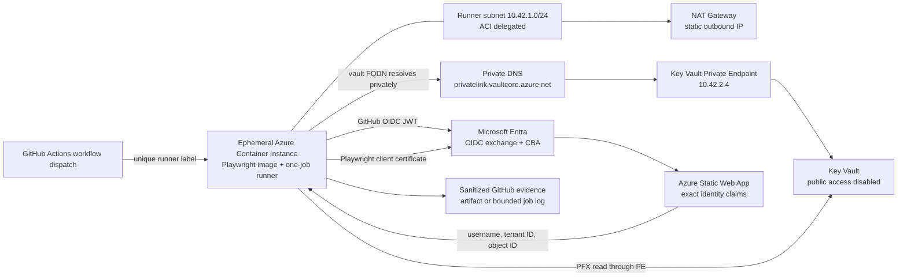

# Verified Playwright Authentication with Entra CBA

> Part of the [dev-agents-solutions](../../README.md) repository. The application, infrastructure,
> Playwright tests, deployment automation, Conditional Access transaction, evidence verifier, and
> operating guidance are self-contained in `solutions/entra-cba-playwright/`.

This solution verifies unattended Microsoft Entra certificate-based authentication with exact
Playwright identity assertions, private Key Vault retrieval, GitHub OIDC, deterministic runner
egress, an ephemeral one-job runner, and correlated Conditional Access evidence.

The [enterprise PAR requirement matrix](docs/enterprise-par-requirement-proof.md) maps every
requested capability to its implementation and proof gate. Use the
[internal showcase runbook](docs/internal-showcase.md) to demonstrate the result without relying on
screenshots or rerunning tenant mutations.

## End-to-end Azure runner architecture



The runner is created just in time by `Start-EphemeralGitHubRunner.ps1` in the ACI-delegated subnet. It downloads a SHA-256-pinned GitHub runner, registers with a verification-specific label, executes one job in a Playwright image pinned by OCI SHA-256 digest, and is then deleted and deregistered.

`Runner-Network.ps1` validates the live ARM topology before launch:

- the runner subnet has exactly the ACI delegation and NAT Gateway, with no user-defined route;
- the NAT Gateway has exactly the recorded static outbound IP and no public IP prefix;
- Key Vault has public access disabled and default network action `Deny`;
- the vault Private Endpoint has one approved `vault` connection;
- the Private Endpoint NIC, private DNS A record, and VNet DNS link agree on the same private path.

During CI, `Get-CbaCredentialsFromKeyVault.mjs` independently proves that:

- the container has an IPv4 address inside the runner subnet;
- the vault hostname resolves only to the exact Private Endpoint IP;
- the GitHub OIDC issuer, audience, subject, repository, run, revision, and `self-hosted` runner claim are exact;
- the OIDC exchange succeeds and both Key Vault secrets can be read through the private endpoint.

The GitHub configuration script requires GitHub's immutable owner-ID/repository-ID subject format.
It resolves the repository through the GitHub API and refuses federation unless the numeric owner
and repository identities match the exact default subject prefix returned by GitHub.

The launcher retrieves the receipts from one size-bounded GitHub artifact. Public job-log receipt
fallback is deliberately disabled because Base64 is not confidentiality. The identity receipt
contains only a SHA-256 commitment to the exact UPN, tenant, object ID and application URL; the
launcher recomputes that commitment from ignored local state. It rejects the evidence unless the
network receipt, identity commitment, workflow run, Git commit, ACI runner name/label, Azure
topology and exact Entra identity all match. It records receipt hashes only after ACI deletion and
GitHub runner deregistration are verified.

### Why there is no Private Link Service

Azure Private Link Service publishes an inbound service behind a Standard Load Balancer. A GitHub Actions runner does not accept inbound job traffic; it polls GitHub over outbound HTTPS. Adding a Private Link Service would create an unused inbound surface and would not make Key Vault access more private.

The Private Endpoint in this design is on the consumer path from the ACI runner to Key Vault. GitHub-hosted larger runners with Azure VNet networking would instead use an enterprise `GitHub.Network/networkSettings` delegated subnet, not Private Link Service. This repository is currently owned by a personal GitHub account, so that enterprise-only runner model is not available here.

## Proof contract

This is a fail-closed verification workflow, not a demo that treats a browser redirect as success. A run is accepted only when each layer supplies independent evidence:

1. **PKI:** the selected certificate chains to the recorded disposable CA, has the expected UPN binding, and has the intended single-factor or multifactor classification.
2. **Browser:** Playwright reaches the exact application origin and either reads the expected identity claims or observes the expected Entra rejection.
3. **Identity:** username, tenant ID, object ID, application ID, and per-run correlation ID match the ignored local state.
4. **Conditional Access:** the correlated Entra sign-in record names the exact policy ID and records the required result.
5. **Azure network:** the runner uses the delegated ACI subnet and NAT IP, while the vault name resolves only to its Private Endpoint IP.
6. **Workload identity:** the GitHub OIDC issuer, audience, subject, repository, run ID, and commit SHA are exact before Entra exchanges the token.
7. **GitHub execution:** the expected workflow, job, ephemeral runner, unique label, revision, and conclusion all match.
8. **Cleanup:** the ACI container is deleted, the GitHub runner is deregistered, the lab CA policy is report-only, and any temporary application exclusions are restored exactly.

The test fails if evidence is absent, stale, ambiguous, broader than expected, or from a different identity, application, policy, run, runner, or commit.

## L400 end-to-end runbook

Run commands from `solutions\entra-cba-playwright` in PowerShell 7. The reference implementation requires Node.js 22 or later, Azure CLI, GitHub CLI, Microsoft Graph PowerShell Authentication 2.39.0, OpenSSL 3, and Chromium for Playwright.

### Phase 0: establish operator context

```powershell
$subscription = '<subscription-id-or-name>'
$tenantId = '<tenant-id>'
$testUserUpn = 'cba-playwright-test@contoso.onmicrosoft.com'

npm ci
npx playwright install chromium
az login --tenant $tenantId
az account set --subscription $subscription
az account show
gh auth status
```

Confirm that the Azure account is in the intended tenant and subscription and that `gh` is authenticated to the intended repository. Do not continue on an implicit or mismatched context.

### Phase 1: preview and deploy the Azure boundary

```powershell
.\scripts\Deploy-Infrastructure.ps1 `
    -Subscription $subscription `
    -ExpectedTenantId $tenantId `
    -WhatIf
.\scripts\Deploy-Infrastructure.ps1 `
    -Subscription $subscription `
    -ExpectedTenantId $tenantId
```

The deployment creates the Static Web App, VNet, ACI-delegated runner subnet, NAT Gateway and static public IP, Private Endpoint subnet, private DNS zone and VNet link, private Key Vault, and workload identities. The script persists discovered resource IDs and addresses under `.lab-state`, which is Git-ignored.

Before any runner launch, `Runner-Network.ps1` reads ARM and rejects the topology unless:

- the runner subnet is delegated only to Azure Container Instances;
- the expected NAT Gateway is attached and no route table is attached;
- the NAT Gateway uses the exact public IP and no public IP prefix;
- Key Vault public network access is disabled and its default action is `Deny`;
- one approved `vault` Private Endpoint exists;
- the Private Endpoint NIC, DNS A record, and VNet link resolve to the same private IP.

### Phase 2: create the disposable two-level certificate test

```powershell
.\scripts\New-LabPki.ps1 -TestUserUpn $testUserUpn
```

The script creates one disposable root CA and two user certificates for the same dedicated test identity:

- the **MFA certificate** contains the configured policy OID and should be classified as `multiFactorAuthentication`;
- the **SFA certificate** omits that policy OID and should be classified as `singleFactorAuthentication`.

Private keys, PFX passphrases, and generated state remain in ignored directories. The public CRL must outlive the user certificates and expire before the CA.

### Phase 3: deploy the relying application

```powershell
npm run build:app
.\scripts\Deploy-TestApp.ps1 -TestUsername $testUserUpn
```

The script creates or reuses one single-tenant SPA registration, configures only the exact Static Web App redirect URI, deploys the static application, and records the application and service-principal object IDs. The page exposes only the authenticated claims required by the tests.

### Phase 4: configure Entra CBA and the isolated lab policy

```powershell
.\scripts\Connect-EntraCbaLabGraph.ps1 -TenantId $tenantId
.\scripts\Configure-EntraCba.ps1 `
    -TenantId $tenantId `
    -TestUserUpn $testUserUpn
.\scripts\Configure-ConditionalAccess.ps1 `
    -TenantId $tenantId `
    -State enabledForReportingButNotEnforced
```

The Graph connection requires the explicit scopes printed by the script. `Configure-EntraCba.ps1` snapshots the existing X.509 authentication-method and PKI configuration before it changes anything. It then:

1. creates or validates the dedicated test user and group;
2. verifies that the group contains only the test user;
3. uploads the disposable CA;
4. configures `PrincipalName` to `userPrincipalName` binding;
5. keeps the default certificate strength single-factor;
6. maps the private policy OID to multifactor;
7. enables CRL checking with no issuer or affinity bypass.

`Configure-ConditionalAccess.ps1` creates or validates one policy scoped to exactly the dedicated group and application. Its only grant is the built-in `Phishing-resistant MFA` authentication strength. Keep it report-only except inside the bounded proof transaction.

### Phase 5: prove browser behavior locally

```powershell
.\scripts\Invoke-LocalFeasibility.ps1 -Headed -ShowProof
.\scripts\Invoke-LocalFeasibility.ps1 -WrongOrigin
.\scripts\Invoke-LocalFeasibility.ps1 -Repeat 5
.\scripts\Invoke-LocalFeasibility.ps1 -ReuseSession
```

The headed run leaves the exact identity claims visible for human inspection. The wrong-origin test proves that Playwright does not leak the PFX to an unapproved origin. The repeated fresh runs test reliability. Session reuse must reach the application without another request to the Entra certificate-authentication origin.

These first runs are feasibility prechecks. The final acceptance receipts are generated again after
the cloud run creates its deterministic proof-set ID, so every local browser control, cloud receipt
and Conditional Access receipt binds to the same tested repository revision.

### Phase 6: publish secrets and configure GitHub OIDC

```powershell
.\scripts\Publish-LabAssets.ps1
$proofBranch = (git branch --show-current).Trim()
.\scripts\Configure-GitHubOidc.ps1 `
    -AllowedBranches @('main', $proofBranch)
```

The publisher receives secret-write access only during publication and runs an Azure CLI image
pinned by its MCR manifest SHA-256 digest. The script verifies the deployed ACI image before
accepting publication. The PFX and passphrase are separate Key Vault secrets. The GitHub workload
identity receives secret-read access but no secret mutation role. GitHub receives nonsecret IDs,
names, addresses and expected claims as environment variables; no GitHub secret contains the
certificate.

### Phase 7: run Playwright on the ephemeral Azure runner

For the first feature-branch proof, commit and push the workflow so the `push` event creates the queued run. Then execute:

```powershell
.\scripts\Start-EphemeralGitHubRunner.ps1
```

After the workflow exists on the default branch, execute:

```powershell
.\scripts\Start-EphemeralGitHubRunner.ps1 -Dispatch
```

The launcher:

1. identifies one exact queued workflow by path, branch, and commit SHA;
2. creates an ACI instance with a unique run-scoped runner name and label;
3. downloads the pinned GitHub runner archive and verifies its SHA-256;
4. starts the one-job ephemeral runner in the digest-pinned Playwright image;
5. exchanges the GitHub OIDC token only after exact claim validation;
6. resolves and reads Key Vault only through the Private Endpoint;
7. runs Playwright with the retrieved certificate;
8. validates the sanitized identity and network receipts;
9. cancels an unfinished workflow on failure;
10. deletes the ACI group and verifies GitHub runner deregistration in `finally`.

Artifact upload is mandatory. If artifact storage is unavailable or exhausted, the workflow and
launcher fail closed rather than print identity or network receipts into a public job log.

Bind the final local controls to the cloud-tested revision:

```powershell
$runnerProof = Get-Content .\.lab-state\runner.json -Raw | ConvertFrom-Json
$proofSetId = $runnerProof.proofSetId

.\scripts\Invoke-LocalFeasibility.ps1 -Headed -ProofSetId $proofSetId
.\scripts\Invoke-LocalFeasibility.ps1 -WrongOrigin -ProofSetId $proofSetId
.\scripts\Invoke-LocalFeasibility.ps1 -Repeat 5 -ProofSetId $proofSetId
.\scripts\Invoke-LocalFeasibility.ps1 -ReuseSession -ProofSetId $proofSetId
```

### Phase 8: prove Conditional Access authentication strength

First run the positive scenario with the MFA-classified certificate. Then run the negative scenario with the SFA-classified certificate. If tenant-wide MFA policies also target the lab app, they must be isolated or they become the causal failure before the lab policy can be evaluated.

This reference tenant has three approved Microsoft-managed MFA policy IDs. The orchestrator accepts only those exact IDs and requires an explicit exclusive Conditional Access maintenance-window acknowledgement:

```powershell
$policyIds = @(
    '<managed-policy-id-1>',
    '<managed-policy-id-2>',
    '<managed-policy-id-3>'
) -join ','

.\scripts\Invoke-ConditionalAccessProof.ps1 `
    -TenantId $tenantId `
    -BrowserScenario Both `
    -InterferingPolicyIdsCsv $policyIds `
    -ConfirmExclusiveConditionalAccessWindow `
    -PropagationSeconds 900 `
    -NegativeFinalizationSeconds 120 `
    -EvidenceTimeoutMinutes 30
```

The orchestrator connects Microsoft Graph with one raw device-code access token.
`Connect-MgGraph -AccessToken` cannot refresh that token. Before any tenant
mutation, the orchestrator decodes the JWT expiry and requires enough remaining
authorization time for the propagation wait, negative finalization wait,
evidence timeout, and a ten-minute operational and restoration reserve. The
documented values require 57 minutes. If the issued token cannot cover the
calculated window, the run fails before changing either the lab policy or the
managed-policy exclusions. Device-token polling retries OAuth pending/slow-down responses,
prematurely ended responses and transient HTTP 5xx responses only within the server-issued
authorization window. Recovery-only mode requires at least ten minutes.

The transaction performs these operations in order:

1. takes an exclusive local lock so a second orchestrator cannot overlap;
2. obtains a Graph token and proves its tenant, scopes, and remaining lifetime;
3. recovers any prior incomplete schema-v3 isolation journal;
4. reads the three exact policies and verifies their IDs, display name, template ID, enabled state, all-users scope, all-applications scope, all-client-app scope, and MFA grant;
5. atomically persists each original `excludeApplications` set and a canonical invariant hash before mutation;
6. patches only `excludeApplications`, adding only the lab application;
7. requires a newer `modifiedDateTime`, exact exclusions, and an unchanged invariant hash after every PATCH;
8. verifies the lab policy in report-only, enables it, and waits for policy propagation;
9. runs the SFA Playwright scenario with a unique correlation ID;
10. restores and verifies the lab policy as report-only before long audit polling;
11. classifies each managed policy as untouched, temporarily changed, or conflicted;
12. restores only the approved baseline exclusions, requires a newer version, and verifies every invariant;
13. polls Entra sign-in logs only after all policies are safe.

Microsoft Graph does not return an ETag for this resource and ignored an invalid `If-Match` value in the reference tenant. The explicit maintenance-window switch is therefore required: no administrator may edit these three policies during the bounded transaction. If exclusions differ from either the baseline or baseline-plus-lab-app set, restoration fails closed and preserves the concurrent values for manual review.

If execution is interrupted, run recovery before another proof:

```powershell
.\scripts\Invoke-ConditionalAccessProof.ps1 `
    -TenantId $tenantId `
    -InterferingPolicyIdsCsv $policyIds `
    -ConfirmExclusiveConditionalAccessWindow `
    -RestoreIsolationOnly
```

### Phase 9: interpret the sign-in evidence

The positive gate requires all of the following on the exact correlation ID:

- at least one terminal application record with error code `0`;
- an exact lab-policy result `success` within the same correlation;
- certificate authentication level `multiFactorAuthentication`;
- successful X.509 authentication step;
- modern PKI store (`Is Legacy Store Used = 0`).

Entra can emit the terminal application success and the successful policy/CBA step as companion
records under one correlation—for example, when a `50140` keep-me-signed-in interrupt accompanies
the final `0` record. The assertion requires both correlated facts and rejects the proof if any
record in that correlation reports the lab policy as `failure` or `reportOnlyFailure`.

The negative gate requires:

- terminal error code `500187`;
- failure reason stating that the certificate does not meet the Conditional Access authentication-strength criteria;
- exact lab policy result `failure`;
- certificate authentication level `singleFactorAuthentication`;
- failed X.509 authentication step;
- modern PKI store.

A browser-visible rejection alone is not enough. A global MFA policy failure, a report-only lab result, a missing policy ID, or an uncorrelated sign-in record keeps the end-to-end gate failed.

## Verified target results

A run from another repository does not satisfy this solution's proof contract. The accepted result
must originate from `samitks77/dev-agents-solutions`, use the immutable repository OIDC subject and
match the exact target commit. After a completed deployment, run:

```powershell
.\scripts\Show-E2eProof.ps1
```

The verifier re-queries GitHub and Azure, re-hashes the bounded CI receipts, validates the
sanitized positive and negative Entra receipts, checks the restoration journal and confirms that
no ephemeral compute or repository runner remains. The exact target run, commit, correlations and
report SHA-256 are recorded here only after that command passes.

The propagation experiment from the implementation phase remains operationally significant. A
two-minute wait produced a browser rejection while unrelated global policies were still causal.
After a 15-minute wait, the exact lab policy failed and all isolated policies were `notApplied`.
The runbook therefore uses 900 seconds and does not accept Graph configuration read-back as proof
that Conditional Access enforcement has propagated.

### Phase 10: verify safe completion

After every proof, independently verify:

- the lab policy is `enabledForReportingButNotEnforced`;
- all managed policies are enabled with their exact original application exclusions;
- `.lab-state\conditional-access-isolation.json` records `status: restored`;
- no ACI lab container remains;
- no ephemeral GitHub runner remains.

Raw Playwright traces and videos are disabled. Runtime state, credentials, and receipts are
Git-ignored. Scripts discover addresses and resource IDs from ARM and do not trust documentation
as configuration.

## CRL renewal

Renew the CRL with the existing CA by running `.\scripts\Update-LabCrl.ps1`, redeploy the application, and then run `.\scripts\Test-PublishedCrl.ps1`. Verification requires exact bytes and SHA-256 plus a valid signature, issuer, authority key identifier, and future `nextUpdate`.

## Teardown

Run `.\scripts\Remove-EntraCbaLab.ps1 -TenantId $tenantId`. The command requires confirmation, restores the recorded X.509 authentication-method baseline, restores or deletes the exact Conditional Access policy, and removes only the recorded lab CA, PKI, group, and user IDs.
