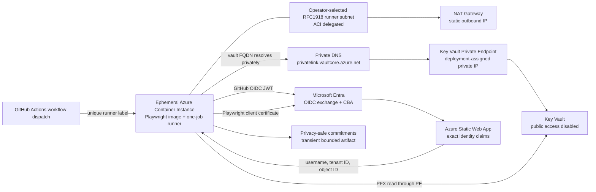

# Verified Playwright Authentication with Entra CBA

> Part of the [dev-agents-solutions](../../README.md) repository. The application, infrastructure,
> Playwright tests, deployment automation, Conditional Access transaction, evidence verifier, and
> operating guidance are self-contained in `solutions/entra-cba-playwright/`.

This solution verifies unattended Microsoft Entra certificate-based authentication with exact
Playwright identity assertions, private Key Vault retrieval, GitHub OIDC, deterministic runner
egress, an ephemeral one-job runner, and correlated Conditional Access evidence.

The [enterprise PAR requirement matrix](docs/enterprise-par-requirement-proof.md) maps every
requested capability to its implementation and proof gate. Use the
[internal showcase runbook](docs/internal-showcase.md) to demonstrate the result without relying on
screenshots or rerunning tenant mutations.

## Deploy infrastructure now

[](https://portal.azure.com/#create/Microsoft.Template/uri/https%3A%2F%2Fraw.githubusercontent.com%2Fsamitks77%2Fdev-agents-solutions%2Fmain%2Fsolutions%2Fentra-cba-playwright%2Ftemplates%2Fazuredeploy%2Fentra-cba-playwright-infrastructure.json)
[](http://armviz.io/#/?load=https%3A%2F%2Fraw.githubusercontent.com%2Fsamitks77%2Fdev-agents-solutions%2Fmain%2Fsolutions%2Fentra-cba-playwright%2Ftemplates%2Fazuredeploy%2Fentra-cba-playwright-infrastructure.json)

This button deploys **Azure resource-plane infrastructure only**: the Log Analytics workspace, two
managed identities, the NAT-gated runner network, the private Key Vault, and the Static Web App
described by [`infra/portal.bicep`](infra/portal.bicep), which wraps
[`infra/main.bicep`](infra/main.bicep) and exposes only three predefined, non-overlapping RFC1918
network profiles. Azure automatically creates a Microsoft Entra service principal behind each
user-assigned managed identity, so the template requires an explicit acknowledgement before
deployment. It does not authenticate an operator to Microsoft Graph or GitHub, create users or
groups, configure CBA or Conditional Access, or enable any access-control policy. See
[`templates/azuredeploy/README.md`](templates/azuredeploy/README.md) for the parameter and output
reference, and use `./scripts/Deploy-Infrastructure.ps1` instead if you want the deployment outputs
captured automatically or need custom RFC1918 prefixes. The button cannot write to your local disk,
so a separate discovery step is required afterward.

In the Azure portal:

1. select the intended test subscription and resource group;
2. choose a supported region;
3. choose the predefined network profile that does not overlap with networks you may later connect;
4. acknowledge that the two managed identities create backing Entra service principals;
5. review the infrastructure-only changes, then select **Create**;
6. wait for a successful deployment before running the bootstrap command below.

### One command to finish setup after the button

The portal button bypasses `Deploy-Infrastructure.ps1`'s automatic capture of deployment outputs
into `.lab-state`. Apart from the two disclosed managed-identity service principals, it performs no
PKI, Entra CBA, Conditional Access, Key Vault secret, or GitHub configuration. Run exactly one
command to safely rediscover the infrastructure and perform every remaining tenant-mutating step,
in order, with a fail-closed confirmation gate:

```powershell
./scripts/Bootstrap-PostDeploy.ps1 `
    -Subscription <subscription-id> `
    -ExpectedTenantId <tenant-id> `
    -ResourceGroup <resource-group-name> `
    -TestUserUpn <dedicated-test-user-upn> `
    -CertificatePolicyOid <organization-controlled-certificate-policy-oid> `
    -Repository <github-owner>/<repository-name> `
    -ConfirmTenantMutations
```

The command first performs read-only Azure and GitHub discovery. It then prints the resolved tenant
ID, subscription ID, repository, and specific mutation list before requiring you to type `CONFIRM`
(not just press Enter). No post-deployment PKI, cloud, tenant, Conditional Access, or GitHub mutation
occurs before that confirmation.
See [Post-deployment bootstrap](#post-deployment-bootstrap) below for the full contract, including
the non-interactive `-ConfirmTenantMutations` + `ENTRA_CBA_BOOTSTRAP_AUTOAPPROVE` double-confirmation
path.

## Post-deployment bootstrap

`./scripts/Bootstrap-PostDeploy.ps1` is the single command that finishes what the Deploy to Azure
button intentionally does not do. It stops on the first failure:

1. **Read-only preflight:** `Import-InfrastructureState.ps1` resolves the named or latest matching
   successful deployment and independently compares all 17 security-relevant outputs with live
   Azure resources. It reconstructs the app/CRL URLs, verifies both managed-identity client,
   principal and resource IDs, reuses the exact runner network/private-DNS contract, and runs the
   same Key Vault RBAC assertion as the script deployment path. Only a stale direct Secrets Officer
   assignment may pass as repairable drift only when its exact assignment ID, vault and publisher
   principal are bound in the ignored `publisher-operation.json` journal; unrelated, inherited or
   unrecorded direct or self-elevatable mutation access fails preflight.
2. **Explicit consent:** after GitHub ADMIN access and the resolved Azure context are verified, the
   shared gate prints the exact mutation scope and requires the switch plus typed `CONFIRM`.
3. **RBAC recovery:** after consent, removes only the exact assignment recorded before a prior
   publisher operation, then requires both identities to have no standing direct or
   self-elevatable secret-mutation access. No unrecorded assignment is changed.
4. **PKI:** creates the disposable PKI or validates that existing ignored state is bound to the same
   UPN, policy OID and CRL URL and that every required file/hash remains valid. `-RegeneratePki`
   requires either no dependent Entra state or a completed, tenant-bound teardown record. After
   validating every recorded state hash, bootstrap retires the old ownership/evidence records and
   only then creates the replacement PKI.
5. **Application and CRL:** creates the unique relying-party app, deploys the Static Web App, and
   verifies the exact published CRL bytes and signature.
6. **Key Vault:** publishes the current PFX and passphrase on every bootstrap invocation through the
   temporary private ACI publisher. Stale timestamps never cause publication to be skipped.
7. **Entra:** obtains one reusable Graph authorization, creates only new disposable user/group/PKI
   objects or exact objects previously recorded as created by this solution, and configures CBA.
8. **Conditional Access and GitHub:** creates or verifies the exact solution-owned report-only
   policy, then configures the selected repository's OIDC federation and encrypted environment
   secrets.

Bootstrap, FreshRun, and teardown all take the same exclusive local lifecycle lock, so they cannot
overlap in one checkout. Graph and Azure creation journals use a ten-minute appearance window
before deciding whether an interrupted create is absent; cleanup then gets a separate bounded
verification window.

The Entra CBA authentication-method policy is tenant-wide. Use an isolated test tenant whenever
possible; otherwise use an approved exclusive maintenance window and complete teardown.

### Fail-closed consent gate

After read-only discovery succeeds but before any mutation, the command prints the exact resolved
tenant ID, subscription ID, GitHub repository, and itemized mutation list, then enforces:

| Situation | Result |
|---|---|
| `-ConfirmTenantMutations` not supplied | **Abort.** No default or missing flag is ever treated as consent. |
| `-ConfirmTenantMutations` supplied, interactive session | You must type the literal word `CONFIRM` at the prompt. Anything else (including a blank Enter) aborts. |
| `-ConfirmTenantMutations` supplied, non-interactive session, `$env:ENTRA_CBA_BOOTSTRAP_AUTOAPPROVE` not exactly `CONFIRMED` | **Abort.** |
| `-ConfirmTenantMutations` supplied, non-interactive session, `$env:ENTRA_CBA_BOOTSTRAP_AUTOAPPROVE = 'CONFIRMED'` | Proceeds without an interactive prompt — the intentional, doubly-confirmed unattended path. |

Any ambiguity (a redirected console, an unset or misspelled environment variable, a missing switch)
always resolves to **abort**. Nothing about this gate can be satisfied silently.

```powershell
# Interactive (recommended): the switch plus a typed CONFIRM prompt.
./scripts/Bootstrap-PostDeploy.ps1 -Subscription <sub-id> -ExpectedTenantId <tenant-id> `
    -ResourceGroup <rg-name> -TestUserUpn <upn> -CertificatePolicyOid <oid> `
    -Repository <owner>/<repo> -ConfirmTenantMutations

# Intentional non-interactive automation: requires BOTH the switch AND the env var.
$env:ENTRA_CBA_BOOTSTRAP_AUTOAPPROVE = 'CONFIRMED'
./scripts/Bootstrap-PostDeploy.ps1 -Subscription <sub-id> -ExpectedTenantId <tenant-id> `
    -ResourceGroup <rg-name> -TestUserUpn <upn> -CertificatePolicyOid <oid> `
    -Repository <owner>/<repo> -ConfirmTenantMutations
```

## Customer-ready validation package

Download the
[full end-to-end test results and manual operator runbook](docs/entra-cba-playwright-e2e-test-results-and-runbook.pdf).
The report explains why and how each of the 37 proof checks was performed, records the
observed result and evidence source for every check, and provides:

- a safe public-proof verification path with no tenant mutation;
- a read-only live evidence-replay path for an authorized operator with retained local state;
- the complete fresh deployment, browser, GitHub runner, Conditional Access, recovery, cleanup and
  teardown procedure;
- expected outputs, stop conditions, troubleshooting guidance and a blank evidence record for a new
  run.

Published PDF SHA-256:
`3652ac22fa468a13374fcd2c6a74c339ca44a9da94554ef0c269982304e5195a`.

The report is deliberately sanitized: it contains no credential, private key, certificate,
passphrase, token, raw sign-in record, tenant/subscription/user/object/application/policy identifier,
sign-in correlation or workflow-run identifier, deployed hostname, or IP address.

## Public template safety

This repository contains no populated tenant, subscription, user, object, application, policy,
certificate, passphrase, token, or deployed-resource identifiers. Values written as `<placeholder>`
are required operator inputs and must be replaced only in the local shell or ignored runtime state.
Do not commit a populated `.env` file or any file under `.auth`, `.lab-secrets`, `.lab-state`, or
`.artifacts`.

Some literals intentionally remain because they are public platform constants, not customer data:

- Microsoft Graph first-party application/resource IDs and a Microsoft-managed policy template ID;
- Azure built-in Key Vault role definition IDs;
- Microsoft service endpoints;
- SHA-256 pins for GitHub Actions, runner archives, and Microsoft container images.

The deployment discovers every tenant-specific and subscription-specific value at runtime and
writes it only to Git-ignored state. The example environment file contains comments and
nonfunctional placeholders.

## End-to-end Azure runner architecture



The runner is created just in time by `Start-EphemeralGitHubRunner.ps1` in the ACI-delegated subnet. It downloads a SHA-256-pinned GitHub runner, registers with a verification-specific label, executes one job in a Playwright image pinned by OCI SHA-256 digest, and is then deleted and deregistered. The launcher allows a bounded 15-minute registration window because regional ACI provisioning can exceed 10 minutes; the job then has its own separate bounded lifetime.

`Runner-Network.ps1` validates the live ARM topology before launch:

- the runner subnet has exactly the ACI delegation and NAT Gateway, with no user-defined route;
- the NAT Gateway has exactly the recorded static outbound IP and no public IP prefix;
- Key Vault has public access disabled and default network action `Deny`;
- the vault Private Endpoint has one approved `vault` connection;
- the Private Endpoint NIC, private DNS A record, and VNet DNS link agree on the same private path.

During CI, `Get-CbaCredentialsFromKeyVault.mjs` independently proves that:

- the container has an IPv4 address inside the runner subnet;
- the vault hostname resolves only to the exact Private Endpoint IP;
- the GitHub OIDC issuer, audience, subject, repository, run, revision, and `self-hosted` runner claim are exact;
- the OIDC exchange succeeds and both Key Vault secrets can be read through the private endpoint.

The GitHub configuration script requires GitHub's immutable owner-ID/repository-ID subject format.
It resolves the repository through the GitHub API and refuses federation unless the numeric owner
and repository identities match the exact default subject prefix returned by GitHub.

The launcher retrieves two privacy-safe receipts from one size-bounded transient GitHub artifact.
Public job-log receipt fallback is deliberately disabled because Base64 is not confidentiality.
The receipts contain SHA-256 commitments and pass/fail assertions instead of raw user, tenant,
subscription, application, vault, network, OIDC subject, runner, or verification identifiers. The
launcher recomputes every commitment it can from ignored local state, rejects cross-run or
cross-identity evidence, and deletes the remote artifact after verified download. It also downloads
the completed public job log and fails if any exact, URL-encoded, or Base64-encoded lab value is
present. Receipt and log hashes are recorded only after ACI deletion, artifact deletion, and GitHub
runner deregistration are verified. The transient ACI address is retained only in Git-ignored local
state so a later operator can replay the same complete log-privacy value set.

### Why there is no Private Link Service

Azure Private Link Service publishes an inbound service behind a Standard Load Balancer. A GitHub Actions runner does not accept inbound job traffic; it polls GitHub over outbound HTTPS. Adding a Private Link Service would create an unused inbound surface and would not make Key Vault access more private.

The Private Endpoint in this design is on the consumer path from the ACI runner to Key Vault. GitHub-hosted larger runners with Azure VNet networking would instead use an enterprise `GitHub.Network/networkSettings` delegated subnet, not Private Link Service. This repository is currently owned by a personal GitHub account, so that enterprise-only runner model is not available here.

## Proof contract

This is a fail-closed verification workflow, not a demo that treats a browser redirect as success. A run is accepted only when each layer supplies independent evidence:

1. **PKI:** the selected certificate chains to the recorded disposable CA, has the expected UPN binding, and has the intended single-factor or multifactor classification.
2. **Browser:** Playwright reaches the exact application origin and either reads the expected identity claims or observes the expected Entra rejection.
3. **Identity:** username, tenant ID, object ID, application ID, and per-run correlation ID match the ignored local state.
4. **Conditional Access:** the correlated Entra sign-in record names the exact policy ID and records the required result.
5. **Azure network:** the runner uses the delegated ACI subnet and NAT IP, while the vault name resolves only to its Private Endpoint IP.
6. **Workload identity:** the GitHub OIDC issuer, audience, subject, repository, run ID, and commit SHA are exact before Entra exchanges the token.
7. **GitHub execution:** the expected workflow, job, ephemeral runner, unique label, revision, and conclusion all match.
8. **Public-output privacy:** the job log contains no protected lab value, receipts disclose only commitments, and the transient artifact is deleted after verified download.
9. **Cleanup:** the ACI container is deleted, the GitHub runner is deregistered, the lab CA policy is report-only, and any temporary application exclusions are restored exactly.

The test fails if evidence is absent, stale, ambiguous, broader than expected, or from a different identity, application, policy, run, runner, or commit.

## L400 end-to-end runbook

Run commands from `solutions\entra-cba-playwright` in PowerShell 7. The reference implementation requires Node.js 22 or later, Azure CLI, GitHub CLI, Microsoft Graph PowerShell Authentication 2.39.0, OpenSSL 3, and Chromium for Playwright.

### Phase 0: establish operator context

```powershell
$repository = '<github-owner>/<repository-name>' # Repository containing this solution on main.
$subscription = '<azure-subscription-id-or-name>' # Operator input; never commit a populated value.
$tenantId = '<entra-tenant-id>' # Tenant that will contain the disposable test identity.
$resourceGroup = '<resource-group-name>' # New or existing isolated lab resource group.
$location = '<azure-region>' # Region supporting ACI, NAT Gateway, Key Vault and Static Web Apps.
$testUserUpn = '<dedicated-test-user-upn>' # Disposable lab identity; never use a production user.
$certificatePolicyOid = '<organization-controlled-certificate-policy-oid>'

# Select non-overlapping RFC1918 ranges for the target network.
$virtualNetworkAddressPrefix = '<virtual-network-cidr>'
$runnerSubnetAddressPrefix = '<aci-runner-subnet-cidr>'
$privateEndpointSubnetAddressPrefix = '<private-endpoint-subnet-cidr>'

npm ci
npx playwright install chromium
az login --tenant $tenantId
az account set --subscription $subscription
az account show
gh auth status
```

Confirm that the Azure account is in the intended tenant and subscription and that `gh` is authenticated to the intended repository. Do not continue on an implicit or mismatched context.

### Phase 1: preview and deploy the Azure boundary

```powershell
.\scripts\Deploy-Infrastructure.ps1 `
    -Subscription $subscription `
    -ExpectedTenantId $tenantId `
    -ResourceGroup $resourceGroup `
    -Location $location `
    -VirtualNetworkAddressPrefix $virtualNetworkAddressPrefix `
    -RunnerSubnetAddressPrefix $runnerSubnetAddressPrefix `
    -PrivateEndpointSubnetAddressPrefix $privateEndpointSubnetAddressPrefix `
    -WhatIf
.\scripts\Deploy-Infrastructure.ps1 `
    -Subscription $subscription `
    -ExpectedTenantId $tenantId `
    -ResourceGroup $resourceGroup `
    -Location $location `
    -VirtualNetworkAddressPrefix $virtualNetworkAddressPrefix `
    -RunnerSubnetAddressPrefix $runnerSubnetAddressPrefix `
    -PrivateEndpointSubnetAddressPrefix $privateEndpointSubnetAddressPrefix `
    -ConfirmManagedIdentityServicePrincipals
```

The deployment creates the Static Web App, VNet, ACI-delegated runner subnet, NAT Gateway and
static public IP, Private Endpoint subnet, private DNS zone and VNet link, private Key Vault, and
workload identities. `-ConfirmManagedIdentityServicePrincipals` explicitly acknowledges that Azure
also creates the two identities' backing Entra service principals. The script persists discovered
resource IDs and addresses under `.lab-state`, which is Git-ignored.

Before any runner launch, `Runner-Network.ps1` reads ARM and rejects the topology unless:

- the runner subnet is delegated only to Azure Container Instances;
- the expected NAT Gateway is attached and no route table is attached;
- the NAT Gateway uses the exact public IP and no public IP prefix;
- Key Vault public network access is disabled and its default action is `Deny`;
- one approved `vault` Private Endpoint exists;
- the Private Endpoint NIC, DNS A record, and VNet link resolve to the same private IP.

### Phase 2: create the disposable two-level certificate test

```powershell
.\scripts\New-LabPki.ps1 `
    -TestUserUpn $testUserUpn `
    -PolicyOid $certificatePolicyOid
```

The script creates one disposable root CA and two user certificates for the same dedicated test identity:

- the **MFA certificate** contains the configured policy OID and should be classified as `multiFactorAuthentication`;
- the **SFA certificate** omits that policy OID and should be classified as `singleFactorAuthentication`.

Private keys, PFX passphrases, and generated state remain in ignored directories. The public CRL must outlive the user certificates and expire before the CA.

### Phase 3: deploy the relying application

```powershell
npm run build:app
.\scripts\Deploy-TestApp.ps1 -TestUsername $testUserUpn
```

The script creates or reuses one single-tenant SPA registration, configures only the exact Static Web App redirect URI, deploys the static application, and records the application and service-principal object IDs. The page exposes only the authenticated claims required by the tests.

### Phase 4: configure Entra CBA and the isolated lab policy

```powershell
.\scripts\Connect-EntraCbaLabGraph.ps1 -TenantId $tenantId
.\scripts\Configure-EntraCba.ps1 `
    -TenantId $tenantId `
    -TestUserUpn $testUserUpn
.\scripts\Configure-ConditionalAccess.ps1 `
    -TenantId $tenantId `
    -State enabledForReportingButNotEnforced
```

The Graph connection requires the explicit scopes printed by the script. `Configure-EntraCba.ps1` snapshots the existing X.509 authentication-method and PKI configuration before it changes anything. It then:

1. creates or validates the dedicated test user and group;
2. verifies that the group contains only the test user;
3. uploads the disposable CA;
4. configures `PrincipalName` to `userPrincipalName` binding;
5. keeps the default certificate strength single-factor;
6. maps the private policy OID to multifactor;
7. enables CRL checking with no issuer or affinity bypass.

`Configure-ConditionalAccess.ps1` creates or validates one policy scoped to exactly the dedicated group and application. Its only grant is the built-in `Phishing-resistant MFA` authentication strength. Keep it report-only except inside the bounded proof transaction.

### Phase 5: prove browser behavior locally

```powershell
.\scripts\Invoke-LocalFeasibility.ps1 -Headed -ShowProof
.\scripts\Invoke-LocalFeasibility.ps1 -WrongOrigin
.\scripts\Invoke-LocalFeasibility.ps1 -Repeat 5
.\scripts\Invoke-LocalFeasibility.ps1 -ReuseSession
```

The headed run leaves the exact identity claims visible for human inspection. The wrong-origin test proves that Playwright does not leak the PFX to an unapproved origin. The repeated fresh runs test reliability. Session reuse must reach the application without another request to the Entra certificate-authentication origin.

These first runs are feasibility prechecks. The final acceptance receipts are generated again after
the cloud run creates its deterministic proof-set ID, so every local browser control, cloud receipt
and Conditional Access receipt binds to the same tested repository revision.

### Phase 6: publish secrets and configure GitHub OIDC

```powershell
.\scripts\Publish-LabAssets.ps1
.\scripts\Configure-GitHubOidc.ps1 `
    -Repository $repository `
    -AllowedBranches @('main')
```

The publisher receives secret-write access only during publication and runs an Azure CLI image
pinned by its MCR manifest SHA-256 digest. The script verifies the deployed ACI image before
accepting publication. The PFX and passphrase are separate Key Vault secrets. The GitHub workload
identity receives secret-read access but no direct or self-elevatable secret mutation capability.
That dedicated identity must have exactly one federated credential matching the immutable
repository/environment subject; configuration and every runner launch reject additional trust
paths. Deployment identifiers are stored as encrypted GitHub environment secrets so GitHub masks
their exact values in public logs; legacy environment variables are removed after migration. No
GitHub secret contains the certificate or its passphrase.

### Phase 7: run Playwright on the ephemeral Azure runner

After the workflow exists on the repository's default branch, execute:

```powershell
.\scripts\Start-EphemeralGitHubRunner.ps1 `
    -Repository $repository `
    -Dispatch `
    -Ref main
```

The launcher:

1. identifies one exact queued workflow by path, branch, and commit SHA;
2. creates an ACI instance with a unique run-scoped runner name and label;
3. downloads the pinned GitHub runner archive and verifies its SHA-256;
4. starts the one-job ephemeral runner in the digest-pinned Playwright image;
5. exchanges the GitHub OIDC token only after exact claim validation;
6. resolves and reads Key Vault only through the Private Endpoint;
7. runs Playwright with the retrieved certificate;
8. validates the commitment-only identity and network receipts;
9. scans the completed job log against every exact and encoded local deployment value;
10. deletes the transient GitHub artifact after verified download;
11. deletes any workflow run whose public log cannot be verified;
12. cancels an unfinished workflow on failure;
13. deletes the ACI group and verifies GitHub runner deregistration in `finally`.

Artifact upload is mandatory. If artifact storage is unavailable or exhausted, the workflow and
launcher fail closed rather than print receipts into a public job log. The artifact contains no raw
lab identifier and is deleted after the launcher verifies and saves its two local ignored copies.
A failed or unavailable log-privacy replay causes the entire workflow run and its logs to be deleted.

Bind the final local controls to the cloud-tested revision:

```powershell
$runnerProof = Get-Content .\.lab-state\runner.json -Raw | ConvertFrom-Json
$proofSetId = $runnerProof.proofSetId

.\scripts\Invoke-LocalFeasibility.ps1 -Headed -ProofSetId $proofSetId
.\scripts\Invoke-LocalFeasibility.ps1 -WrongOrigin -ProofSetId $proofSetId
.\scripts\Invoke-LocalFeasibility.ps1 -Repeat 5 -ProofSetId $proofSetId
.\scripts\Invoke-LocalFeasibility.ps1 -ReuseSession -ProofSetId $proofSetId
```

### Phase 8: prove Conditional Access authentication strength

First run the positive scenario with the MFA-classified certificate. Then run the negative scenario with the SFA-classified certificate. If tenant-wide MFA policies also target the lab app, they must be isolated or they become the causal failure before the lab policy can be evaluated.

This reference tenant has three approved Microsoft-managed MFA policy IDs. The orchestrator accepts only those exact IDs and requires an explicit exclusive Conditional Access maintenance-window acknowledgement:

```powershell
$policyIds = @(
    '<managed-policy-id-1>',
    '<managed-policy-id-2>',
    '<managed-policy-id-3>'
) -join ','

.\scripts\Invoke-ConditionalAccessProof.ps1 `
    -TenantId $tenantId `
    -BrowserScenario Both `
    -InterferingPolicyIdsCsv $policyIds `
    -ConfirmExclusiveConditionalAccessWindow `
    -PropagationSeconds 900 `
    -NegativeFinalizationSeconds 120 `
    -EvidenceTimeoutMinutes 30
```

The orchestrator connects Microsoft Graph with one raw device-code access token.
`Connect-MgGraph -AccessToken` cannot refresh that token. Before any tenant
mutation, the orchestrator decodes the JWT expiry and requires enough remaining
authorization time for the propagation wait, negative finalization wait,
evidence timeout, and a ten-minute operational and restoration reserve. The
documented values require 57 minutes. If the issued token cannot cover the
calculated window, the run fails before changing either the lab policy or the
managed-policy exclusions. Device-token polling retries OAuth pending/slow-down responses,
prematurely ended responses and transient HTTP 5xx responses only within the server-issued
authorization window. Recovery-only mode requires at least ten minutes.

The transaction performs these operations in order:

1. takes the shared lifecycle lock plus the Conditional Access isolation lock so bootstrap,
   FreshRun, and teardown cannot overlap in one checkout;
2. obtains a Graph token and proves its tenant, scopes, and remaining lifetime;
3. recovers any prior incomplete schema-v3 isolation journal;
4. reads the three exact policies and verifies their IDs, display name, template ID, enabled state, all-users scope, all-applications scope, all-client-app scope, and MFA grant;
5. atomically persists each original `excludeApplications` set and a canonical invariant hash before mutation;
6. patches only `excludeApplications`, adding only the lab application;
7. requires a newer `modifiedDateTime`, exact exclusions, and an unchanged invariant hash after every PATCH;
8. verifies the lab policy in report-only, enables it, and waits for policy propagation;
9. runs the SFA Playwright scenario with a unique correlation ID;
10. restores and verifies the lab policy as report-only before long audit polling;
11. classifies each managed policy as untouched, temporarily changed, or conflicted;
12. restores only the approved baseline exclusions, requires a newer version, and verifies every invariant;
13. polls Entra sign-in logs only after all policies are safe.

Microsoft Graph does not return an ETag for this resource and ignored an invalid `If-Match` value in the reference tenant. The explicit maintenance-window switch is therefore required: no administrator may edit these three policies during the bounded transaction. If exclusions differ from either the baseline or baseline-plus-lab-app set, restoration fails closed and preserves the concurrent values for manual review.

If execution is interrupted, run recovery before another proof:

```powershell
.\scripts\Invoke-ConditionalAccessProof.ps1 `
    -TenantId $tenantId `
    -InterferingPolicyIdsCsv $policyIds `
    -ConfirmExclusiveConditionalAccessWindow `
    -RestoreIsolationOnly
```

### Phase 9: interpret the sign-in evidence

The positive gate requires all of the following on the exact correlation ID:

- at least one terminal application record with error code `0`;
- an exact lab-policy result `success` within the same correlation;
- certificate authentication level `multiFactorAuthentication`;
- successful X.509 authentication step;
- modern PKI store (`Is Legacy Store Used = 0`).

Entra can emit the terminal application success and the successful policy/CBA step as companion
records under one correlation—for example, when a `50140` keep-me-signed-in interrupt accompanies
the final `0` record. The assertion requires both correlated facts and rejects the proof if any
record in that correlation reports the lab policy as `failure` or `reportOnlyFailure`.

The negative gate requires:

- terminal error code `500187`;
- failure reason stating that the certificate does not meet the Conditional Access authentication-strength criteria;
- exact lab policy result `failure`;
- certificate authentication level `singleFactorAuthentication`;
- failed X.509 authentication step;
- modern PKI store.

A browser-visible rejection alone is not enough. A global MFA policy failure, a report-only lab result, a missing policy ID, or an uncorrelated sign-in record keeps the end-to-end gate failed.

## Verified target results

A run from another repository does not satisfy this solution's proof contract. The accepted result
must originate from the operator-supplied repository recorded in ignored GitHub state, use that
repository's immutable OIDC subject, and match the exact target commit. After a completed
deployment, run:

```powershell
.\scripts\Show-E2eProof.ps1
```

The verifier re-queries GitHub and Azure, re-hashes the bounded CI receipts, validates the
sanitized positive and negative Entra receipts, checks the restoration journal and confirms that
no ephemeral compute or repository runner remains. The exact target run, commit, correlations and
report SHA-256 are recorded here only after that command passes. This is exactly Tier B of the
[three-tier verification model](#three-tier-verification-model) below; prefer invoking it as
`.\scripts\Invoke-EntraCbaVerification.ps1 -Tier EvidenceReplay` so the tier is explicit in your
terminal history.

The propagation experiment from the implementation phase remains operationally significant. A
two-minute wait produced a browser rejection while unrelated global policies were still causal.
After a 15-minute wait, the exact lab policy failed and all isolated policies were `notApplied`.
The runbook therefore uses 900 seconds and does not accept Graph configuration read-back as proof
that Conditional Access enforcement has propagated.

### Phase 10: verify safe completion

After every proof, independently verify:

- the lab policy is `enabledForReportingButNotEnforced`;
- all managed policies are enabled with their exact original application exclusions;
- `.lab-state\conditional-access-isolation.json` records `status: restored`;
- no ACI lab container remains;
- no ephemeral GitHub runner remains.

Raw Playwright traces and videos are disabled. Runtime state, credentials, and receipts are
Git-ignored. Scripts discover addresses and resource IDs from ARM and do not trust documentation
as configuration.

## Three-tier verification model

`./scripts/Invoke-EntraCbaVerification.ps1 -Tier <PublicProof|EvidenceReplay|FreshRun>` is the
single unified entry point for verification. It never implies that one tier is equivalent to
another: each tier prints a visually distinct banner and a distinct pass/fail marker. The
[GitHub Actions workflow](../../.github/workflows/entra-cba-verification.yml) exposes only the safe
public-proof tier.

| Tier | Script invocation | What it checks | Tenant mutation | Banner |
|---|---|---|---|---|
| **A — Public proof** | `-Tier PublicProof` | Repository hygiene, the exact portal ARM output contract, the published PDF hash, and the downloaded public proof's pinned SHA-256, 37/0 result, cleanup, restoration and privacy fields. | **None.** Anonymous HTTPS download only; no authentication or tenant access. This verifies published evidence, not a new sign-in. | `PUBLIC_PROOF_PASS` |
| **B — Read-only evidence replay** | `-Tier EvidenceReplay` | Runs `Show-E2eProof.ps1` against retained receipts and live read-only Azure/GitHub state, then fails unless `overallResult` is `PASS` with exactly 37 passed, 0 failed and 37 check records. | **None.** Live Azure/GitHub reads only. | `EVIDENCE_REPLAY_PASS` |
| **C — Fresh end-to-end proof** | See the command below. | Creates one new cloud/browser proof set, regenerates headed, wrong-origin, five-run reliability and session-reuse controls, performs correlated MFA/SFA Conditional Access proof, restores every policy, then requires exactly 37/37. | **Yes.** Ephemeral Azure/GitHub activity plus a bounded Conditional Access transaction. Requires both general typed consent and the exclusive-window switch. | `FRESH_RUN_PASS` |

Checking Tier A's static artifact is never a substitute for Tier B, and replaying Tier B's retained
evidence is never a substitute for a fresh Tier C run — the wrapper's banners, the underlying
scripts' own output, and the workflow scope all say so explicitly.

Run a fresh proof locally from the clean, cloud-tested commit:

```powershell
$policyIds = @(
    '<reviewed-managed-policy-id-1>',
    '<reviewed-managed-policy-id-2>',
    '<reviewed-managed-policy-id-3>'
) -join ','

./scripts/Invoke-EntraCbaVerification.ps1 `
    -Tier FreshRun `
    -Repository <github-owner>/<repository-name> `
    -Ref main `
    -InterferingPolicyIdsCsv $policyIds `
    -ConfirmTenantMutations `
    -ConfirmExclusiveConditionalAccessWindow `
    -PropagationSeconds 900 `
    -NegativeFinalizationSeconds 120 `
    -EvidenceTimeoutMinutes 30
```

The [verification workflow](../../.github/workflows/entra-cba-verification.yml) intentionally exposes
only the safe Tier A button in the Actions tab. Tier B needs retained ignored local evidence, and
Tier C needs an authenticated operator, a headed desktop, reviewed policy IDs, and explicit consent;
both therefore run only through the local unified command.

## CRL renewal

Renew the CRL with the existing CA by running `.\scripts\Update-LabCrl.ps1`, redeploy the application, and then run `.\scripts\Test-PublishedCrl.ps1`. Verification requires exact bytes and SHA-256 plus a valid signature, issuer, authority key identifier, and future `nextUpdate`.

## Teardown

Run `.\scripts\Remove-EntraCbaLab.ps1 -TenantId $tenantId`. The command requires confirmation, restores the recorded X.509 authentication-method baseline, restores or deletes the exact Conditional Access policy, and removes only the recorded lab CA, PKI, group, and user IDs.
