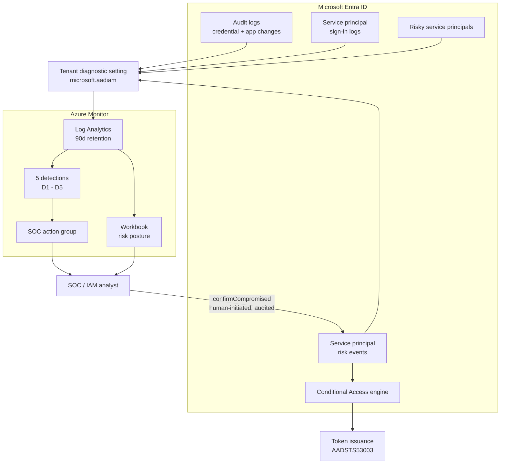
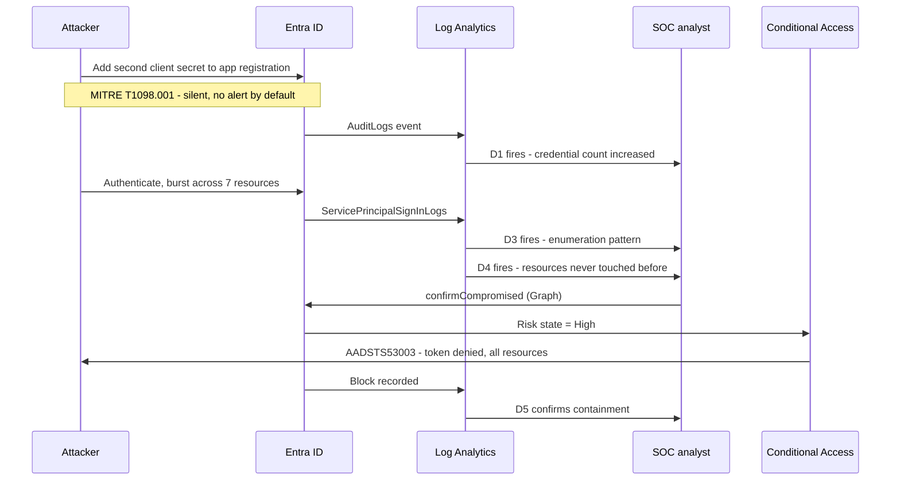

# silentkey-warden — Workload Identity Protection (Entra + Azure Monitor)

> Part of the [dev-agents-solutions](../../README.md) repo. Fully self-contained: ARM template,
> detections, Conditional Access policy, scripts, runbooks, and an interactive POC guide all live
> here in `solutions/silentkey-warden/`.


**Your user accounts have MFA, risk-based Conditional Access, and a human who notices when something
breaks. Your service principals have a static secret, a two-year expiry, no owner, and usually more
permissions than they need.**

**Which one would you attack?**

This solution brings adaptive protection to the identities nobody is watching — and, more usefully,
turns a one-off proof of concept into a **standing detection layer** that keeps working after the
demo ends.

---

## Deploy Now

[](https://portal.azure.com/#create/Microsoft.Template/uri/https%3A%2F%2Fraw.githubusercontent.com%2Fsamitks77%2Fdev-agents-solutions%2Fmain%2Fsolutions%2Fsilentkey-warden%2Ftemplates%2Fazuredeploy%2Fworkload-identity-protection.json)
[](http://armviz.io/#/?load=https%3A%2F%2Fraw.githubusercontent.com%2Fsamitks77%2Fdev-agents-solutions%2Fmain%2Fsolutions%2Fsilentkey-warden%2Ftemplates%2Fazuredeploy%2Fworkload-identity-protection.json)

Deploys the detection layer:

- Log Analytics workspace — 90-day retention, resource-permission access model
- SOC action group
- **5 scheduled query alert rules** — the detections below
- Azure Monitor workbook — workload identity risk posture

Two follow-up steps are **not** in the template, deliberately, because neither is a
resource-group-scoped resource: Entra diagnostic settings are tenant-scoped, and the Conditional
Access policy lives in Microsoft Graph. Both are one script each.
See [Quick Start](#quick-start).

---

## The idea

Running the POC proves five attacks against workload identities are possible. That is worth doing
once.

The problem is what happens next: the tenant goes back to exactly the state it was in before, and
nothing is watching for the next attempt. The POC guide even says so — *"SOC teams should create
monitoring rules to alert on credential-addition events."*

**This solution is those rules.** Every manual test in the POC becomes a production detection.

| POC test | Attack behaviour | Becomes detection | MITRE |
|---|---|---|---|
| **A** — Admin confirms compromised | Credentials surfaced in threat intel | [D2](detections/D2-risky-workload-identity-detected.kql) — Risky workload identity (High/Medium) | T1078 |
| **B** — Backdoor credential | Second client secret added silently | [D1](detections/D1-credential-added-to-application.kql) — Credential added to application | **T1098.001** |
| **C** — Anomalous Fabric access | Identity pivots to a resource it never used | [D4](detections/D4-workload-identity-first-time-resource.kql) — First-time resource access | T1078 |
| **D** — Burst sign-in | 7 resources in 10 seconds — enumeration | [D3](detections/D3-workload-identity-burst-signin.kql) — Multi-resource burst | T1078, T1087 |
| **E** — CA enforcement | Token issuance denied | [D5](detections/D5-workload-identity-blocked-by-ca.kql) — Blocked by CA (`AADSTS53003`) | — |
| *bonus* | "If I enforce this, what breaks?" | [D6](detections/D6-report-only-enforcement-readiness.kql) — Enforcement readiness *(hunting)* | — |

---

## Architecture at a glance



The loop closes at the bottom: the analyst's response action feeds straight back into the risk
events Conditional Access evaluates. Enforcement lands at the **token issuance layer**, so a blocked
identity gets nothing — not Graph, not ARM, not Key Vault, not SQL, not Fabric. No agent, no
application change.

### The attack, end to end



---

## Quick Start

> All commands assume you have `cd`'d into `solutions/silentkey-warden/`.

**Check this first:** Workload Identities Premium is a **standalone SKU**, not part of Entra ID P2.
It is the number one reason these POCs stall on day one.
*Entra admin center → Billing → Licenses → All products → `Workload Identities Premium`*

```powershell
# 1. Validate before deploying (local-only mode needs no Azure session)
./scripts/validate-workload-identity-bootstrap.ps1 -SkipAzureChecks

# 2. Deploy the detection layer
./scripts/deploy-workload-identity-bootstrap.ps1 `
  -SubscriptionId <sub> -ResourceGroupName rg-silentkey-warden `
  -Location eastus2 -SocEmailAddress soc@contoso.com

# 3. Stream Entra logs in - THE STEP EVERYONE FORGETS
#    Without this the detections deploy perfectly and stay permanently blind.
./scripts/configure-entra-diagnostics.ps1 -WorkspaceResourceId "<from step 2 output>"

# 4. Create the Conditional Access policy - report-only by default
./scripts/deploy-conditional-access-policy.ps1 -ScopeAllServicePrincipals

# 5. Verify it is deployed AND receiving data
./scripts/post-deploy-smoke-test.ps1 -SubscriptionId <sub> -ResourceGroupName rg-silentkey-warden

# 6. Prove it works - creates 4 disposable identities, runs all 5 scenarios
./scripts/invoke-poc-risk-simulation.ps1 -WhatIf   # preview
./scripts/invoke-poc-risk-simulation.ps1           # run it

# 7. Clean up the test identities (leaves the detection layer in place)
./scripts/remove-poc-resources.ps1
```

Full runbook with the reasoning behind every step:
[`docs/workload-identity-deploy-to-azure.md`](docs/workload-identity-deploy-to-azure.md)

Prefer to walk it manually? Open the interactive guide:
[`docs/workload-identity-poc-guide.html`](docs/workload-identity-poc-guide.html) — 9 core steps and
5 scenarios, self-contained dark-mode artifact.

---

## The detail that matters most

**Report-only is the default, and the transition to enforcement is evidence-based.**

Blocking a workload identity is an outage. Unlike a user, there is nobody to call the help desk —
it surfaces as a batch job that silently stopped, or an API returning 401s to a customer.

So the enforcement path is gated on data, not confidence:

1. Deploy report-only. Zero impact.
2. Run for **7 days**, covering a full weekend batch cycle.
3. Run [D6](detections/D6-report-only-enforcement-readiness.kql).
4. Read `WouldHaveBlocked`. **That is your blast radius.**
5. Zero, or every identity accounted for → enforce. Otherwise, find the owners first.

`deploy-conditional-access-policy.ps1` will not even create the policy without an explicit scope
decision. It refuses to guess the blast radius of a blocking policy.

---

## Repository map

```text
solutions/silentkey-warden/
├── README.md
├── CHANGELOG.md · CONTRIBUTING.md · SECURITY.md
├── docs/
│   ├── README.md                                           # Documentation index
│   ├── workload-identity-poc-guide.html                    # Interactive POC guide (dark mode)
│   ├── workload-identity-architecture.md                   # Data flow, trust boundaries, trade-offs
│   ├── workload-identity-deploy-to-azure.md                # Deployment runbook (what + why)
│   ├── workload-identity-security-governance.md            # Permission model, threat model gaps
│   ├── workload-identity-operations-runbook.md             # Day-2 triage and incident response
│   ├── workload-identity-demo-playbook.md                  # 30-minute demo talk-track
│   └── workload-identity-enterprise-readiness-checklist.md # Go-live gates
├── detections/
│   ├── README.md                                           # Detection library index + MITRE map
│   ├── D1-credential-added-to-application.kql              # T1098.001 backdoor persistence
│   ├── D2-risky-workload-identity-detected.kql             # Identity Protection risk events
│   ├── D3-workload-identity-burst-signin.kql               # Lateral movement enumeration
│   ├── D4-workload-identity-first-time-resource.kql        # Anomalous resource pivot
│   ├── D5-workload-identity-blocked-by-ca.kql              # AADSTS53003 containment
│   └── D6-report-only-enforcement-readiness.kql            # Blast radius before enforcing
├── policies/
│   ├── README.md                                           # CA design + report-only to enforced path
│   └── ca-block-risky-workload-identities.json             # Graph policy body
├── scripts/
│   ├── validate-workload-identity-bootstrap.ps1            # Local + Azure preflight
│   ├── deploy-workload-identity-bootstrap.ps1              # Idempotent ARM wrapper
│   ├── configure-entra-diagnostics.ps1                     # Tenant-scoped log streaming
│   ├── deploy-conditional-access-policy.ps1                # CA policy via Graph
│   ├── invoke-poc-risk-simulation.ps1                      # Drives all 5 scenarios
│   ├── post-deploy-smoke-test.ps1                          # Deployed AND receiving data
│   └── remove-poc-resources.ps1                            # Reverses the simulation
└── templates/
    ├── README.md
    └── azuredeploy/
        ├── README.md                                       # Parameter + output reference
        ├── workload-identity-protection.json               # ARM template
        ├── workload-identity-protection.parameters.json
        └── workload-identity-protection-explained.md       # Resource-by-resource rationale
```

---

## Enterprise readiness highlights

- **No runtime identity.** The deployed footprint has no service principal or managed identity with
  standing permission. An auto-containment identity would need tenant-wide DoS capability — a
  solution protecting workload identities would have created the most dangerous one in the tenant.
  [Reasoning](docs/workload-identity-security-governance.md#why-there-is-no-automation-identity).
- **Report-only by default**, with a data-driven path to enforcement and instant rollback.
- **Every script explains what it does and why**, and supports `-WhatIf`.
- **Smoke test verifies data, not just resources.** A detection layer receiving nothing looks
  identical to a working one, right up until an incident.
- **Detection tuning guidance is inline** in each `.kql` file, alongside triage steps.
- **Known limitations are documented, not hidden** — licence dependency, the 3-week ML baseline, D4's
  noisy first fortnight, and sign-in log ingestion cost.
- CI checks JSON templates and PowerShell parsing on every push.

---

## Known limitations

Stated up front, because a technical audience will find them anyway.

| Limitation | Impact | Mitigation |
|---|---|---|
| Workload Identities Premium is a separate SKU | D2 stays empty without it | Verify licensing first; D1, D3, D4, D5 work regardless |
| Entra ML needs ~3 weeks of baseline | Automatic risk detections cannot fire in a fresh tenant | POC uses `confirmCompromised` to simulate the end state — the same API a SOC uses in production |
| D4 is noisy for its first 14 days | False positives while the baseline fills | Expected. Do not tune it down in week one. |
| `ServicePrincipalSignInLogs` is high volume | Dominant ingestion cost in large tenants | Set `dailyQuotaGb`; review after the first full day |
| 15–30 minute log ingestion delay | Detection is not real time | Windows overlap 4:1 so late events are never missed |
| Containment is human-initiated | Not fully automated response | Deliberate. One API call, effective tenant-wide in 1–2 minutes. |

---

## Documentation hub

Start here: [`docs/README.md`](docs/README.md)

## References

- [Securing workload identities](https://learn.microsoft.com/entra/id-protection/concept-workload-identity-risk)
- [Conditional Access for workload identities](https://learn.microsoft.com/entra/identity/conditional-access/workload-identity)
- [Simulate risk detections in Entra ID Protection](https://learn.microsoft.com/entra/id-protection/howto-identity-protection-simulate-risk)
- [`riskyServicePrincipal: confirmCompromised`](https://learn.microsoft.com/graph/api/riskyserviceprincipal-confirmcompromised)
- [Entra ID diagnostic settings](https://learn.microsoft.com/entra/identity/monitoring-health/howto-configure-diagnostic-settings)
- [MITRE ATT&CK T1098.001 — Additional Cloud Credentials](https://attack.mitre.org/techniques/T1098/001/)
