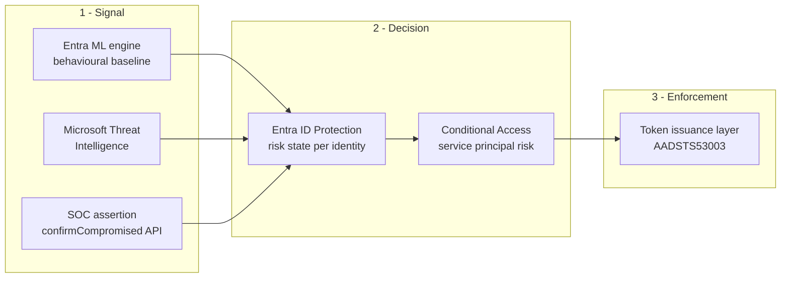
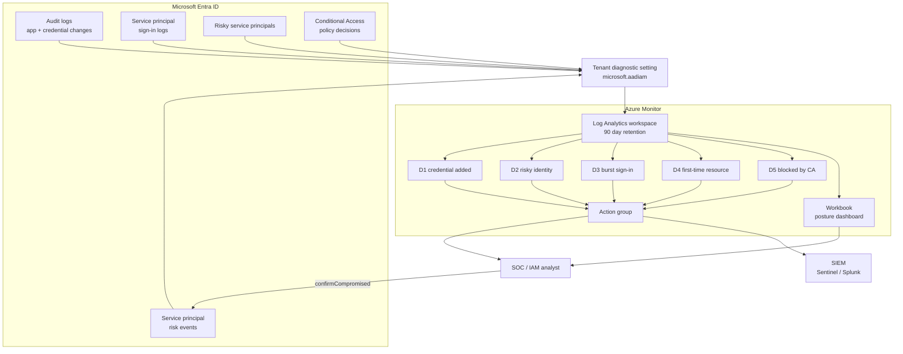
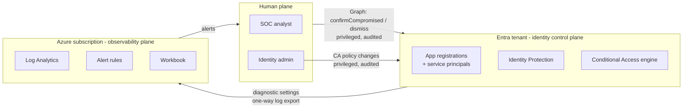

# Architecture

## The problem

Human identities have had adaptive protection for years: risk-based Conditional Access, MFA, sign-in
risk, user risk. Workload identities — service principals and managed identities — usually have
none of it.

That matters because a workload identity is a better target than a user account:

- It holds a **static secret**, often with a multi-year expiry, frequently committed somewhere it
  should not be.
- It has **no MFA**, and no human to notice something is wrong.
- It is often **over-permissioned**, because scoping it correctly was harder than granting
  Contributor at subscription scope during a deadline.
- It authenticates **non-interactively at machine speed**, so anomalous behaviour hides inside
  normal volume.
- Nobody owns it. The engineer who created it changed teams two reorganisations ago.

## The control chain

Workload Identity Protection closes that gap with three linked pieces. This solution deploys all
three and adds the observability layer that makes them operable.

The critical property: enforcement happens at **token issuance**. A blocked identity does not get a
token for *any* resource — not Graph, not ARM, not Key Vault, not SQL, not Fabric. There is no agent
to deploy and no application change to make. It is also invisible to the attacker, who simply sees
authentication stop working.

## What this solution adds

Entra shows current risk state in a portal blade. It does not retain queryable history, it does not
alert, and it cannot answer "did this identity ever touch Key Vault before Tuesday." This solution
adds the observability and detection layer around the control chain.

Note the loop that closes at the bottom: the SOC's response action — `confirmCompromised` — feeds
straight back into the risk events that Conditional Access evaluates. Detection and enforcement are
not separate systems bolted together; the analyst's decision is itself an input to the control.

## Data flow, stage by stage

| Stage | What happens | Latency | Why it matters |
|---|---|---|---|
| 1. Activity | A workload identity authenticates, or its app registration is modified | Real time | The raw event |
| 2. Entra logging | Event written to Entra audit / sign-in / risk logs | Seconds | Native, no agent |
| 3. Diagnostic streaming | Tenant diagnostic setting forwards to Log Analytics | **15–30 min** | The delay that shapes every design decision below |
| 4. Detection | Scheduled query rules evaluate every 15 min over a 1 h window | 15 min | Overlapping windows absorb stage 3's lag |
| 5. Notification | Action group notifies the SOC or SIEM | Seconds | Human enters the loop |
| 6. Response | Analyst confirms compromise via Graph | Immediate | Raises risk to High |
| 7. Enforcement | Conditional Access denies token issuance | 1–2 min | `AADSTS53003`, all resources |

**The 15–30 minute ingestion delay is the single most important number here.** It is why the
detection window (1 h) is four times the evaluation frequency (15 min), and it is why anyone who
runs the POC and checks the sign-in logs after two minutes concludes the demo is broken.

## Trust boundaries

Three properties worth stating explicitly to a security architect:

1. **Log export is one-way.** The observability plane reads a copy of identity events. Nothing in
   Azure Monitor can change identity state.
2. **The only write path back into the tenant is human-initiated and audited** — an analyst calling
   `confirmCompromised` or `dismiss`, or an admin changing the policy. There is no automation in
   this solution with standing permission to block an identity.
3. **The two planes fail independently.** If the workspace is deleted, Conditional Access keeps
   enforcing. If the CA policy is disabled, detections keep firing. Neither is a single point of
   failure for the other.

## Why detections are not fully automated into blocks

`confirmCompromised` could be called automatically from a detection. This solution deliberately
does not do that.

Blocking a workload identity is an outage. Unlike a user, there is nobody to call the help desk when
it breaks — the failure surfaces as a batch job that silently stopped, or an API returning 401s to a
customer. An automated block on a medium-confidence ML signal trades a possible compromise for a
certain, unattributed production incident.

The right sequence is: detect automatically, decide deliberately, enforce instantly. Once an analyst
makes the call, containment is one API call and takes effect in 1–2 minutes across every resource.

## Detection coverage

| POC test | Attack behaviour | Detection | MITRE |
|---|---|---|---|
| A | Credentials surfaced in threat intelligence | D2 | T1078 |
| B | Second client secret added as a backdoor | D1 | T1098.001 |
| C | Identity pivots to a resource it never used | D4 | T1078 |
| D | Burst across many resources — enumeration | D3 | T1078, T1087 |
| E | Conditional Access denies token issuance | D5 | — |

Full queries and triage guidance: [`../detections/README.md`](../detections/README.md).

## Design decisions and their trade-offs

| Decision | Alternative rejected | Reasoning |
|---|---|---|
| Log Analytics as the store | Sentinel workspace | Sentinel is a superset and costs more. This works standalone and drops into Sentinel unchanged if the customer already has it. |
| Scheduled query rules | Sentinel analytics rules | Same KQL, no Sentinel dependency, deployable by anyone with an Azure subscription. |
| 90-day retention | 30-day default | D4's 14-day baseline plus realistic investigation lookback. 30 days is not enough. |
| Report-only CA by default | Enforced by default | An enforced policy on unowned workload identities is an outage waiting to happen. D6 exists to make the transition evidence-based. |
| One action group | Per-severity groups | Routing by severity belongs in the SIEM or on-call tool, not in five configs nobody maintains. |
| Human-in-the-loop containment | Auto-block on detection | See above — a false positive here is a silent production outage with no user to report it. |
